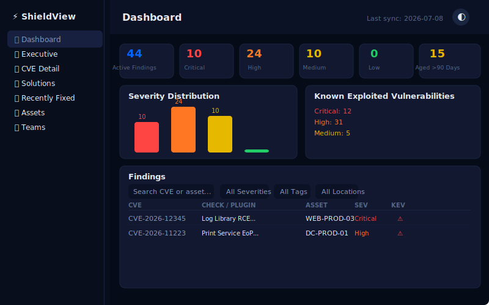

# ShieldView — Vulnerability Management Dashboard

Click-through prototype of an internal vulnerability management dashboard, themed for ShieldView.

**Live demo:** https://mrdavidchaing.github.io/amp-shield/

## What it does

A single-file HTML prototype demonstrating the full vulnerability management workflow: scanner imports → triage → remediation tracking → executive reporting.

## Features

- **Dashboard** with clickable stat cards that filter findings, live search, severity dropdowns, and group-by-check toggle
- **CVE lifecycle tracking** — Active → Actioned → Resolved tabs with per-asset status, owners, ticket references, and fix dates
- **7 teams** including Infrastructure, Platform Engineering, Endpoint Engineering (macOS/Jamf), and more
- **53 assets** across Windows Server, Ubuntu, RHEL, macOS, PAN-OS — with full details and filtering
- **20 CVEs** including Log4Shell, Exchange RCE, Safari WebKit, VMware vCenter, Cisco IOS XE
- **Change request draft modal** — formatted ticket template with copy-to-clipboard
- **Dark/light theme**, collapsible sidebar, mobile-responsive
- **Everything cross-linked** — findings → CVE detail → asset detail → full circle

## Tech

- Single self-contained HTML file (no build step, no dependencies)
- CSS variables for theming
- Pure JavaScript with inline data store
- Hand-rolled SVG charts
- Responsive down to 320px

## Data model (conceptual)

- `cves` — CVE metadata, CVSS, remediation, KEV flags
- `assets` — hostname/IP, OS, site, tags (junction table)
- `asset_cves` — many-to-many with per-asset plugin name, state, first_seen, fixed_at
- `teams` — scope-based asset membership via tag + location matching
- `remediations` — CVE-level triage status separate from per-asset state

Built from a production battle-tested spec covering streaming CSV imports, KEV feed integration, access control, and precomputed caching.

## Open

```bash
open index.html  # macOS
start index.html # Windows
xdg-open index.html # Linux
```

Or just visit the [live demo](https://mrdavidchaing.github.io/amp-shield/).

## Cross-Tool Pipeline

ShieldView is the first step in a 3-tool remediation pipeline:

```
ShieldView (find vulns) → RemFlow (remediate) → TheValidator (verify)
```

ShieldView writes findings to `localStorage` via `sendToRemFlow()`, which RemFlow reads to show pending remediations. When RemFlow completes a deployment, TheValidator picks it up for verification.

| Tool | URL |
|------|-----|
| **ShieldView** | https://mrdchiang.github.io/amp-shield/ |
| **RemFlow** | https://mrdchiang.github.io/remflow/ |
| **TheValidator** | https://mrdchiang.github.io/thevalidator/ |
| **Launchpad** | https://mrdchiang.github.io/security-tools/ |


